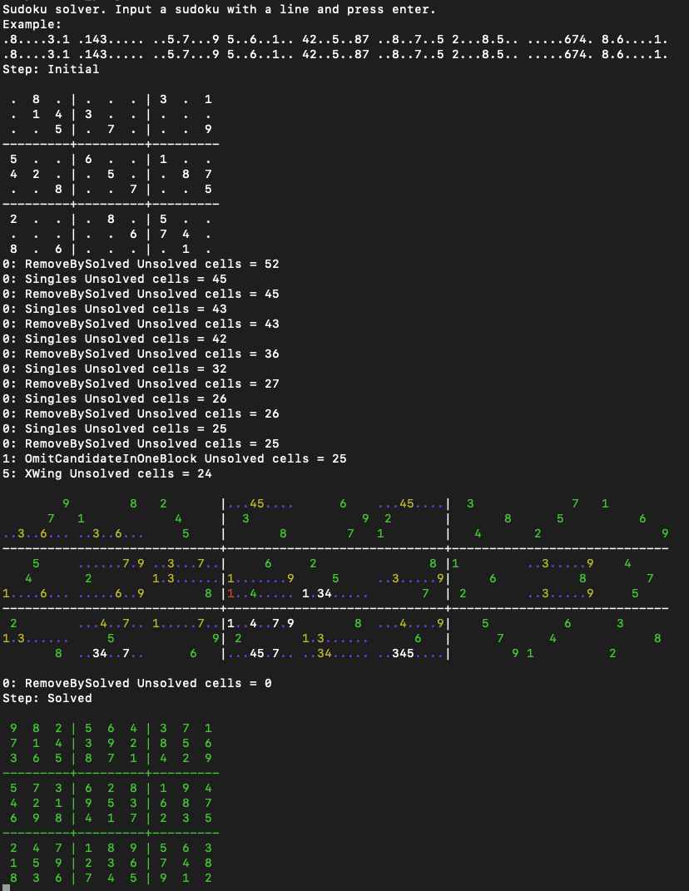
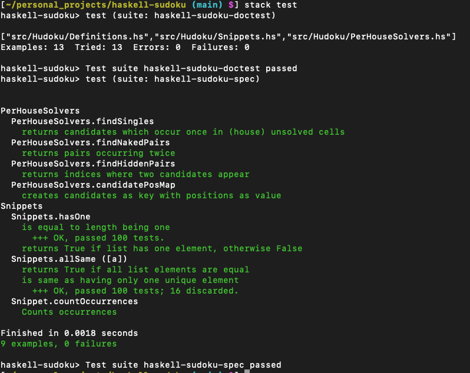

# haskell-sudoku
Simple Sudoku solving with Haskell. The program takes in Sudoku puzzles and outputs
step-by-step info for solving.

## Building and running

Build with

    stack build

and run (and build possible changes) with

    stack run

Run an interactive session with

    stack run session

Pass puzzles from a file:

    cat puzzles.txt | stack run session

Building for profiling

    stack build --profile

And then running with profiling

    cat puzzles.txt | stack exec --profile haskell-sudoku.exe session -- +RTS -p

## Running tests

Run tests with

    stack test

